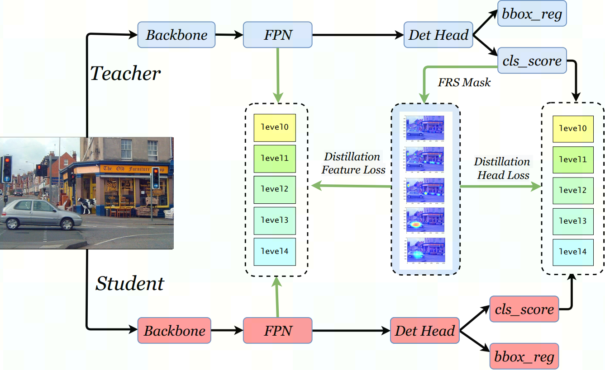

# Feature Richness Score

Implementation of our NeurIPS2021 paper [Distilling Object Detectors with Feature Richness](https://arxiv.org/pdf/2111.00674.pdf)

## Abstract

In recent years, large-scale deep models have achieved great success, but the huge computational complexity and massive storage requirements make it a great challenge to deploy them in resource-limited devices. As a model compression and acceleration method, knowledge distillation effectively improves the performance of small models by transferring the dark knowledge from the teacher detector. However, most of the existing distillation-based detection methods mainly imitating features near bounding boxes, which suffer from two limitations. First, they ignore the beneficial features outside the bounding boxes. Second, these methods imitate some features which are mistakenly regarded as the background by the teacher detector. To address the above issues, we propose a novel Feature-Richness Score (FRS) method to choose important features that improve generalized detectability during distilling. The proposed method effectively retrieves the important features outside the bounding boxes and removes the detrimental features within the bounding boxes. Extensive experiments show that our methods achieve excellent performance on both anchor-based and anchor-free detectors. For example, RetinaNet with ResNet-50 achieves 39.7% in mAP on the COCO2017 dataset, which even surpasses the ResNet-101 based teacher detector 38.9% by 0.8%.

## Install

Please refer to the [install.md](./install.md)

## Experiments

Results of the proposed method with different detection frameworks. we use 2x learning schedule to train 24 epochs or the 1x learning schedule to train 12 epochs on COCO dataset.

|                         | mode | mAP  | AP50 | AP75 | AP\_S | AP\_M | AP\_L |
|-------------------------|------|------|------|------|-------|-------|-------|
| Retina-Res101(teacher)  | 2x   | 38.9 | 58.0 | 41.5 | 21.0  | 42.8  | 52.4  |
| Retina-Res50(student)   | 2x   | 37.4 | 56.7 | 39.6 | 20.0  | 40.7  | 49.7  |
| ours                    | 2x   | 39.7 | 58.6 | 42.4 | 21.8  | 43.5  | 52.4  |
| gain                    |      | +2.3 | +1.9 | +2.8 | +1.8  | +2.8  | +2.7  |
| GFL-Resnet101(teacher)  | 2x   | 44.9 | 63.1 | 49.0 | 28.0  | 49.1  | 57.2  |
| GFL-Resnet50(student)   | 1x   | 40.2 | 58.4 | 43.3 | 23.3  | 44.0  | 52.2  |
| ours                    | 1x   | 43.6 | 61.9 | 47.5 | 25.9  | 47.7  | 56.4  |
| gain                    |      | +3.4 | +3.5 | +4.2 | +2.6  | +3.7  | +4.2  |
| GFL-Resnet101(teacher)  | 2x   | 44.9 | 63.1 | 49.0 | 28.0  | 49.1  | 57.2  |
| GFL-Resnet50(student)   | 2x   | 42.9 | 61.2 | 46.5 | 27.3  | 46.9  | 53.3  |
| ours                    | 2x   | 44.7 | 63.0 | 48.4 | 28.7  | 49.0  | 56.7  |
| gains                   |      | +1.8 | +1.8 | +1.9 | +1.4  | +2.1  | +3.4  |
| Faster-Res101(teacher)  | 1x   | 39.4 | 60.1 | 43.1 | 22.4  | 43.7  | 51.1  |
| Faster-Res50(student)   | 1x   | 37.4 | 58.1 | 40.4 | 21.2  | 41.0  | 48.1  |
| ours                    | 1x   | 39.5 | 60.1 | 43.3 | 22.3  | 43.6  | 51.7  |
| gains                   |      | +2.1 | +2.0 | +2.9 | +1.1  | +2.6  | +3.6  |
| FCOS-Resnet101(teacher) | 2x   | 40.8 | 60.0 | 44.0 | 24.2  | 44.3  | 52.4  |
| FCOS-Resnet50(student)  | 2x   | 38.5 | 57.7 | 41.0 | 21.9  | 42.8  | 48.6  |
| ours                    | 2x   | 40.9 | 60.3 | 43.6 | 25.7  | 45.2  | 51.2  |
| gains                   |      | +2.4 | +2.6 | +2.6 | +3.8  | +2.4  | +2.6  |

## Prerequisites

`python 3.7` `mmdetection` `PyTorch`

